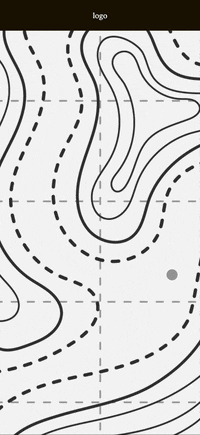

# 3 Web 15 mois cours creative coding avancé

## Le cours se compose en 3 étapes :
- Navigation Drag & Drop et Slides de la carte
- Réalité augmentée
- Prototype final

---

## Cours du 22 octobre 2024

### Drag & drop 1
- Déplacer en drag & drop la carte sur l'axe x : exemple dans le ficher `dragndrop01.html`
 

### Drag & drop 2
- Déplacer la carte en drag & drop sur tous les axes `dragndrop02.html`

### Slides
- Swiper dans les parties de la carte `slides01.html`