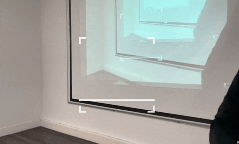

# 3 Web 15 mois cours creative coding avancé

## Le cours se compose en 3 étapes :
1. Navigation Drag & Drop et Slides de la carte
2. Réalité augmentée
3. Prototype final

---

## Cours du 22 octobre 2024 - Navigation avec la carte

### Drag & drop 1
- Déplacer en drag & drop la carte sur l'axe x : exemple dans le ficher `dragndrop01.html`
 

### Drag & drop 2
- Déplacer la carte en drag & drop sur tous les axes `dragndrop02.html`

### Slides
- Swiper dans les parties de la carte `slides01.html`

---

## Cours du 12 et 15 novembre - Utilisation de la réalité augmentée
Pour travailler avec la réalité augmentée nous allons utiliser la librairie [MindAR](https://hiukim.github.io/mind-ar-js-doc/). Les exercices se composent de trois étapes :
- Démo basic provenant de MinAR
- Démo personnalisée avec une seule cible
- Démo personnalisée avec plusieurs cibles détectées les unes après les autres

##### L'animation

La propriété `animation-mixer` sert à jouer l'animation qui est intégrée au fichier 3D au format .gltf. Cette animation est réalisée au préalable dans le logiciel Blender par exemple.

L'animation peut aussi être réalisée avec la propriété `animation` comme dans l'exemple basic :
`animation="property: position; to: 0 0.1 0.1; dur: 1000; easing: easeInOutQuad; loop: true; dir: alternate"`

### Démo personnalisée avec une seule cible

Image cible

### Démo personnalisée avec plusieurs cibles

Image cible 01 (affiche l'objet 3D étoile)

Image cible 02 (affiche l'objet 3D pyramide)

