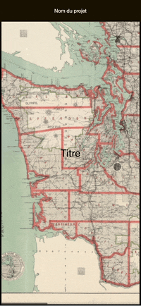

# 3 Web 15 mois cours creative coding avancé

## Le cours se compose de 3 étapes :
1. Navigation Drag & Drop et Slides de la carte
2. Réalité augmentée
3. Prototype final

## Liens

- [Mind AR](https://hiukim.github.io/mind-ar-js-doc/)

- [Image Targets Compiler](https://hiukim.github.io/mind-ar-js-doc/tools/compile/)

- [Visualiser un fichier gtltf en ligne](https://gltf-viewer.donmccurdy.com/)

---

## Cours du 22 octobre 2024 - Navigation avec la carte

### Drag & drop 1
- Déplacer en drag & drop la carte sur l'axe x : exemple dans le ficher `dragndrop01.html`
 

### Drag & drop 2
- Déplacer la carte en drag & drop sur tous les axes `dragndrop02.html`

### Slides
- Swiper dans les parties de la carte `slides01.html`

---

## Cours du 12 et 15 novembre - Utilisation de la réalité augmentée
Pour travailler avec la réalité augmentée nous allons utiliser la librairie [MindAR](https://hiukim.github.io/mind-ar-js-doc/). Les exercices se composent de trois étapes :
- Démo basic provenant de MindAR
- Démo personnalisée avec une seule cible
- Démo personnalisée avec plusieurs cibles détectées les unes après les autres

##### L'animation avec Mind AR

La propriété `animation-mixer` sert à jouer l'animation qui est intégrée au fichier 3D au format .gltf. Cette animation est réalisée au préalable dans le logiciel Blender par exemple.

L'animation peut aussi être réalisée avec la propriété `animation` comme dans l'exemple basic :
`animation="property: position; to: 0 0.1 0.1; dur: 1000; easing: easeInOutQuad; loop: true; dir: alternate"`

### Démo personnalisée avec une seule cible

*image cible*

### Démo personnalisée avec plusieurs cibles

*Démo des deux cibles*

*image cible01 qui affiche l'objet 3D étoile*

*image cible02 qui affiche l'objet 3D pyramide*

---

## Prototype final

Le prototype final se compose de 3 pages : une home (la carte), les détails des cibles (nav swiper) et une page info (utilisation).

Scénario : l'utilisateur·rice se trouve dans un jardin. Il faut trouver 3 plantes dans ce jardin. Une fois trouvée, une cible se trouve à côté (une petite pancarte) qu'il faut scanner avec le smartphone. Une fois scannée, la cible joue un son.

*image cible1*

*image cible2*

*image cible3*

**Ressources :**
[Animate.css](https://animate.style/)
[BBC Sound Effects](https://sound-effects.bbcrewind.co.uk/)
